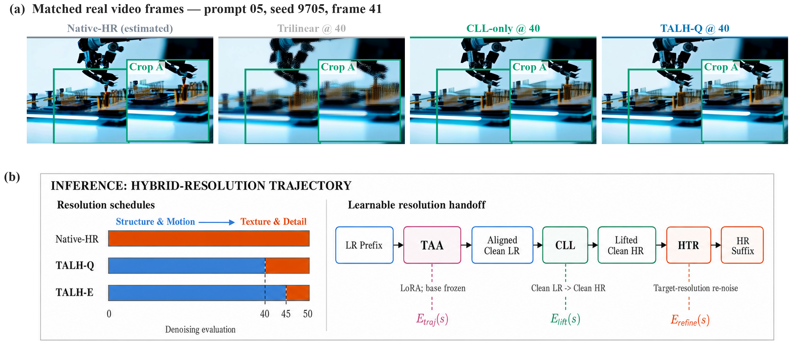
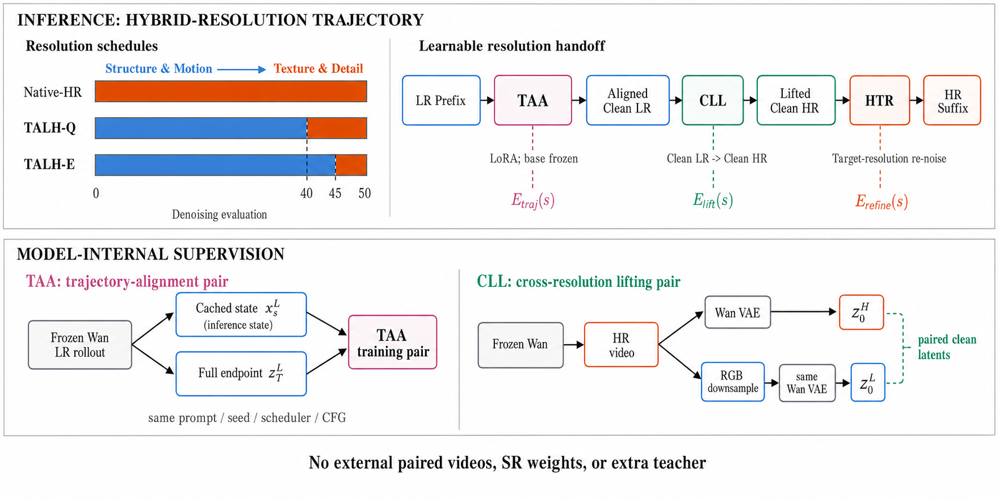
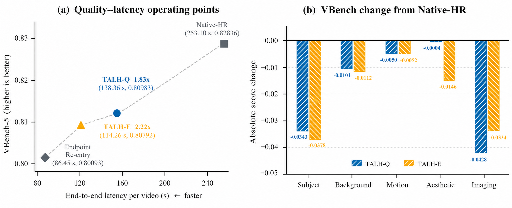
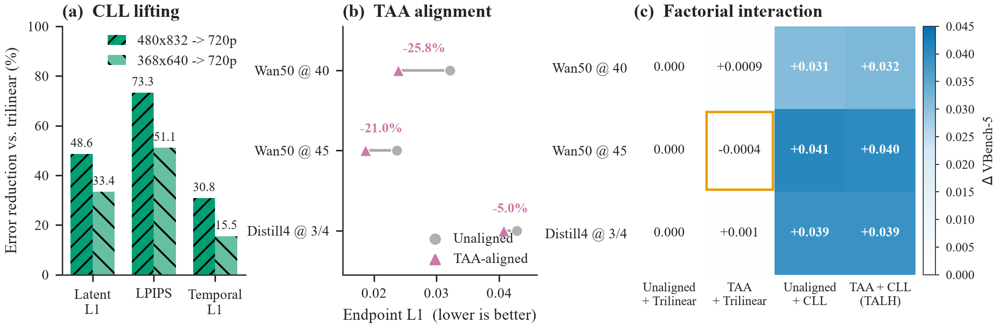

# 面向高分辨率视频扩散加速的轨迹对齐潜空间切换

**Trajectory-Aligned Latent Handoff for Efficient High-Resolution Video Diffusion**

## 摘要

尽管高分辨率视频扩散模型取得了显著进展，但其在长时空潜变量序列上的迭代去噪计算带来了高昂的推理延迟，严重制约了在线内容生成与交互式应用的部署。扩散采样的早期阶段主要建立场景结构与运动，后期阶段逐步补充纹理细节，这为混合分辨率推理提供了加速空间。然而，动态分辨率切换不仅涉及潜变量尺寸变化，还同时受到残余去噪误差、视频VAE跨尺度表示偏差以及高分辨率轨迹失配的影响。本文提出轨迹对齐潜空间切换（Trajectory-Aligned Latent Handoff，TALH），一种面向高分辨率视频生成加速的轻量潜空间超分框架。TALH将核心去噪计算战略性地转移至低分辨率潜空间，从而在根源上削减计算开销。随后，它将复杂的分辨率切换过程解耦为三个紧密衔接的环节：轨迹对齐适配器（TAA）校正切换时刻的残余轨迹差距，纯净潜变量提升器（CLL）学习跨分辨率潜变量映射，高分辨率轨迹重入（HTR）将提升结果重新接入冻结生成器的高分辨率去噪轨迹。TAA采用LoRA参数化，TAA与CLL均由目标生成模型提供监督，无需外部配对视频、外部超分权重或额外教师模型。在50步Wan2.1的368×640→720×1248设置上，质量优先的TALH-Q与效率优先的TALH-E分别实现1.83倍和2.22倍端到端加速，同时保留Native-HR Sampling的97.76%和97.53% VBench-5。模块实验表明，480×832→720×1248的CLL相较三线性插值将潜变量L1误差降低48.6%、LPIPS降低73.3%；在368×640低分辨率轨迹上，TAA将第40步和第45步的终点L1误差分别降低25.8%和21.0%。TALH在标准50步模型和4步蒸馏模型上均表现出稳定的质量—效率权衡。

## 1 引言

以 Wan 为代表的潜空间视频扩散模型已经能够生成具有较强语义一致性、运动表现和视觉细节的视频 [Wan Team et al., 2025]。然而，扩散 Transformer（DiT）的推理开销随空间分辨率和视频长度呈级数增长，原因在于每次去噪迭代都必须处理全局时空 Token 序列。这意味着，即使在仅需建模粗粒度场景结构与宏观运动的采样早期阶段，模型也不得不承担高昂的高分辨率计算成本，造成了严重的计算资源浪费。这一特性显著增加了在线生成的响应延迟，并限制了高分辨率视频模型在交互式内容创作与实时服务中的部署。

扩散轨迹在不同阶段承担不同的生成任务：早期步骤主要确定主体结构、场景布局与运动模式，后期步骤则逐步补充局部纹理和高频细节。因此，一种具有潜力的加速策略是先在低分辨率潜空间完成全局内容建模，再于采样后段切换至目标分辨率，仅用少量高分辨率步骤恢复细节。LightX2V 的 changing-resolution 推理通过三线性插值实现动态分辨率采样 [ModelTC, 2026]；MrFlow 则在图像流匹配模型上揭示了低分辨率结构生成与低噪声高分辨率修复的效率优势 [Zheng et al., 2026]。这类方法改变的是各采样阶段的空间计算规模，因而可与减少采样步数的蒸馏方法互补。

动态分辨率切换并非简单的张量缩放。在第 \(s\) 步得到的单步纯净预测与完整低分辨率轨迹的终点之间仍存在残余去噪差距，且该差距在较早切换时更为明显。与此同时，视频 VAE 的潜变量表示不满足严格的尺度等变性；固定插值只能改变潜变量网格尺寸，无法建模由 VAE、视频内容和尺度变化共同决定的跨分辨率对应关系。提升后的潜变量还需重新进入高分辨率采样轨迹，以便冻结生成器继续补充纹理并修正升分残差。这三类误差共同决定了混合分辨率采样的最终质量。

直接将切换时刻的低分辨率预测映射为高分辨率终点，会使单个联合轨迹—尺度提升器（Joint Trajectory-Scale Lifter，JTSL）同时承担轨迹修复、尺度转换和纹理推断。由于残余轨迹差距随时间步、调度器和文本条件变化，而高分辨率细节又无法由低分辨率输入唯一确定，联合回归容易产生高频衰减。切换步扫描实验的定性结果同样显示，JTSL 相比纯净潜变量之间的跨尺度映射更易产生模糊。该观察促使我们将动态分辨率切换分解为结构明确的局部子问题。

基于上述分析，本文提出 TALH，将动态分辨率切换分解为 TAA、CLL 和 HTR。TAA 仅在指定切换步激活，通过 LoRA 校正当前纯净预测与完整低分辨率轨迹终点之间的偏差；CLL 学习分别编码的低、高分辨率纯净潜变量之间的映射；HTR 按目标分辨率重新加噪，并调用冻结的 Wan 去噪器完成高分辨率后缀。TAA 与 CLL 均由同一个冻结生成模型提供监督：前者使用完整低分辨率轨迹构造轨迹对齐对，后者使用模型生成的高分辨率视频及其降采样版本构造跨分辨率提升对，由此形成统一的模型内生自蒸馏训练体系。图 1 以真实视频帧、分辨率日程和实测工作点概括 TALH 的视觉效果与加速机制。

**图 1：TALH 的真实视频切换效果与加速机制。** (a) 在 prompt 05、seed 9705 的第 41 帧上，比较 `Native-HR (estimated)`、Trilinear、CLL-only 与 TALH-Q 的全帧及同坐标 Crop A。`Native-HR (estimated)` 来自内容对齐的 368p 完整轨迹，其余 handoff 输出为 720p；该行用于内容与结构参照。(b) TALH 的混合分辨率推理路径。Native-HR Sampling 的 50 次去噪均在高分辨率执行，而 TALH-Q 与 TALH-E 分别将前 40 次和 45 次计算转移至低分辨率潜空间，并通过 TAA、CLL 和 HTR 接入保留 10 次或 5 次去噪的高分辨率后缀；两个工作点分别实现 1.83 倍和 2.22 倍加速，同时保留 97.76% 和 97.53% 的 VBench-5。

本文的贡献可以概括为三点：

1. 提出面向高分辨率视频生成加速的 TALH 框架，将大部分去噪计算转移到低分辨率潜空间，并仅在采样后缀恢复高分辨率纹理。TALH-Q 与 TALH-E 分别构成质量优先和效率优先的 Pareto 工作点，为在线推理提供可控的速度—质量折中。
2. 将动态分辨率切换分解为残余轨迹对齐、跨分辨率潜变量提升和高分辨率生成式修复，并分别设计 TAA、CLL 和 HTR。该分解降低了联合轨迹—尺度映射的不确定性，并支持对各模块及其交互作用进行独立分析。
3. 构建无需外部配对视频、外部超分权重或额外教师模型的模型内生训练体系，并给出缓存前缀状态一致性成立的条件。实验在标准 50 步 Wan2.1 与 4 步蒸馏 Wan 上验证了 TALH 的系统效率、模块有效性与跨采样器适用性。

## 2 相关工作

### 2.1 潜空间视频生成与级联升分

Latent Diffusion Models 将生成过程转移到压缩潜空间，为高分辨率图像和视频生成提供了可扩展基础 [Rombach et al., 2022]。Video LDM、Imagen Video 和 LaVie 采用空间或时间级联，从低分辨率生成逐步获得高分辨率视频 [Blattmann et al., 2023; Ho et al., 2022; Wang et al., 2023]。LTX-Video 与 LTX-2 进一步协同设计视频 VAE、潜变量表示与生成 Transformer，其中 LTX-2 公开了独立的 spatial latent upsampler [HaCohen et al., 2024, 2026]。SimpleGVR、LUVE 等近期工作同样研究低分辨率生成器与 latent/video refinement 模块组成的级联系统 [Xie et al., 2025; Zhao et al., 2026]。

上述方法通常将升分器作为生成器之后的独立阶段。TALH 则将 CLL 嵌入同一 Wan 采样轨迹，并通过 HTR 将提升后的潜变量连接至后续调度时刻。由此，跨分辨率提升与高分辨率生成先验被统一在同一推理过程中。

### 2.2 视频超分与时序一致性

Upscale-A-Video、SATeCo、MGLD 与 VideoGigaGAN 分别通过扩散先验、时空适配、运动引导和生成式细节恢复提高视频分辨率并抑制闪烁 [Zhou et al., 2024; Chen et al., 2024; Yang et al., 2024; Xu et al., 2024]。这些方法主要面向已生成或真实低分辨率 RGB 视频的恢复。TALH 工作于 VAE 解码之前的生成潜空间，且提升结果仍需参与后续扩散去噪，因而研究对象是生成轨迹内部的分辨率切换，而非独立的 RGB 视频后处理。

### 2.3 混合分辨率扩散推理

LightX2V changing-resolution 使用固定插值在采样中途改变潜变量尺寸 [ModelTC, 2026]。RALU 指出，无训练潜变量提升会受到高频混叠与分辨率相关噪声—时间步失配的影响，并针对扩散 Transformer 设计混合分辨率处理 [Jeong et al., 2025]。MrFlow 采用低分辨率结构生成、像素域超分、低强度加噪和高分辨率细节修复的分阶段采样，在图像模型上获得显著端到端加速，并证明该策略可与时间步蒸馏结合 [Zheng et al., 2026]。TALH 面向视频生成轨迹，在目标模型的潜空间中学习跨分辨率提升，并在切换前显式校正低分辨率尾轨迹误差。

### 2.4 少步蒸馏与 on-policy 轨迹学习

Progressive Distillation、Consistency Models、LCM 和 Distribution Matching Distillation 从轨迹回归、一致性映射与分布匹配等角度减少扩散模型采样步数 [Salimans and Ho, 2022; Song et al., 2023; Luo et al., 2023; Yin et al., 2024]。VideoLCM 与 Motion Consistency Model 将相关思想扩展到视频 [Wang et al., 2023; Zhai et al., 2024]。Self-Forcing、D-OPSD 和 AnyFlow 进一步强调训练状态与学生模型推理状态的一致性 [Huang et al., 2025; Jiang et al., 2026; Gu et al., 2026]。

TALH 保留原始采样器，并以 TAA 校正单个分辨率切换步骤。由于 TAA 在切换前保持关闭，其参数更新不改变低分辨率前缀轨迹。第 3.5 节据此建立缓存前缀训练状态与推理访问状态的一致性条件。

## 3 方法

### 3.1 问题定义与总体框架

设冻结的 Wan 流预测器为 \(v_\phi(x_s,s,c)\)，其中 \(x_s\) 表示第 \(s\) 次去噪计算前的中间潜变量，\(c\) 为文本条件，\(T\) 为总去噪步数。上标 \(L\) 与 \(H\) 分别表示低分辨率和高分辨率潜空间。记 \(z_T^L\) 为相同文本提示、随机种子、初始噪声和低分辨率调度器下，冻结模型完整运行 \(T\) 步所得的低分辨率轨迹终点；记 \((z_0^L,z_0^H)\) 为同一视频的低、高分辨率版本分别经过 Wan VAE 编码后得到的跨分辨率纯净潜变量对。

TALH 学习两个相互独立的模块：以 LoRA 实现、参数为 \(\Delta\theta_s\) 的 TAA，以及参数为 \(\psi\) 的 CLL 算子 \(U_\psi^{\mathrm{CLL}}\)。HTR 为无额外参数的轨迹重入过程。如图 2 上半部分所示，完整数据流为

\[
x_s^L
\xrightarrow{\mathrm{TAA}:v_{\phi+\Delta\theta_s}}
\widetilde z_s^L
\xrightarrow{U_\psi^{\mathrm{CLL}}}
\widehat z_s^H
\xrightarrow{\mathrm{HTR}}
x_{s+1}^H.
\]

其中，TAA 只负责使当前低分辨率纯净预测接近完整轨迹低分辨率终点；CLL 只负责纯净潜变量的跨分辨率映射。两个模块分别训练，不进行联合反向传播。一方面，这避免了 14B denoiser 与 CLL 同时驻留训练图带来的显存开销；另一方面，它为轨迹误差与尺度误差提供了可分离的实验分析。

切换步骤同时控制三类误差。记切换前的残余轨迹差距为 \(E_{\mathrm{traj}}(s)\)，跨分辨率提升误差为 \(E_{\mathrm{lift}}(s)\)，HTR 后尚未修复的高分辨率误差为 \(E_{\mathrm{refine}}(s)\)，则总误差可概念化为

\[
E_{\mathrm{handoff}}(s)
\approx E_{\mathrm{traj}}(s)
+E_{\mathrm{lift}}(s)
+E_{\mathrm{refine}}(s).
\]

这一概念分解揭示了混合分辨率采样的核心博弈：随着切换步骤 $s$ 的推移，残余轨迹差距 $E_{\mathrm{traj}}(s)$ 呈单调收敛，使得 CLL 的输入逐渐向纯净潜变量的真实分布靠拢（即 $E_{\mathrm{lift}}(s)$ 降低）；然而，此消彼长的是，更晚的切换会导致高分辨率后缀步骤缩短，从而压缩了高频细节的生成式修复预算 $E_{\mathrm{refine}}(s)$。TALH 的设计正是为了在这三者之间寻求最佳的帕累托平衡。

**图 2：TALH 的混合分辨率推理与模型内生训练。** TALH 将大部分去噪计算放在低分辨率潜空间，并在切换点依次执行 TAA 轨迹对齐、CLL 跨分辨率纯净潜变量提升和 HTR 高分辨率轨迹重入。TALH-Q 与 TALH-E 分别保留 10 次和 5 次高分辨率去噪计算，形成质量优先与效率优先的工作点。TAA 的轨迹对齐对和 CLL 的跨分辨率提升对均由同一冻结 Wan 模型产生，无需外部配对视频、外部超分权重或额外教师模型。

### 3.2 模型内生的双重监督数据

TALH 不使用外部配对视频、外部超分模型权重或额外教师模型。CLL 与 TAA 的监督均由冻结的目标生成器产生，但对应两种不同关系；两条数据构建路径如图 2 下半部分所示。

**跨分辨率提升对（Cross-Resolution Lifting Pairs）。** 本文使用预定义文本提示与固定随机种子运行 Wan，生成高分辨率参考视频；随后在 RGB 空间进行空间降采样，并将高、低分辨率版本分别送入同一个 Wan VAE 编码，得到严格对齐的跨分辨率纯净潜变量对 \((z_0^L,z_0^H)\)。该构造保持帧数、语义内容与运动轨迹不变，使 CLL 学习目标模型、目标 VAE 和目标生成分布下的跨尺度对应关系。

**轨迹对齐对（Trajectory Alignment Pairs）。** 本文在相同文本提示、随机种子、初始噪声和调度器下运行冻结模型的完整低分辨率轨迹，缓存进入切换步骤前的低分辨率状态 \(x_s^L\)，并以完整轨迹低分辨率终点 \(z_T^L\) 作为监督。由此，CLL 获得跨分辨率表示监督，TAA 获得跨时间步轨迹监督，两者共同构成模型内生的分辨率—轨迹自蒸馏。

两类监督共享同一生成模型，但对应不同条件分布：CLL 的低分辨率输入由高分辨率参考视频降采样后编码得到，TAA 则对齐原生低分辨率完整轨迹的终点。第 4.3 节通过轨迹状态与分辨率算子的 2×2 因子设计评估二者组合后的端到端作用。

### 3.3 跨分辨率纯净潜变量提升

纯净潜变量提升器（Clean Latent Lifter，CLL）的输入和输出均为 16 通道 Wan VAE 潜变量，且不改变时间维：

\[
U_\psi^{\mathrm{CLL}}:\mathbb{R}^{B\times16\times F\times h\times w}
\rightarrow
\mathbb{R}^{B\times16\times F\times H\times W}.
\]

网络采用受 LTX-2 启发的编码器—重采样器—解码器结构。Conv3D 输入层首先将潜变量投影至 256 维隐藏空间，随后通过 4 个三维残差块提取时空特征；空间重采样器提升分辨率后，再由 4 个三维残差块和 Conv3D 输出层恢复 16 通道潜变量。三维残差处理使模型能够在保持帧数不变的条件下利用相邻潜变量帧的信息。

本文实现两种空间重采样配置。对于 480x832 到 720x1248，潜变量网格从 60x104 变为 90x156。网络先将通道扩展 9 倍，再执行 3 倍空间 PixelShuffle，最后通过固定二项式模糊核以步长 2 下采样，从而实现 3/2 倍有理数放大：

\[
60\times104 \xrightarrow{\times3} 180\times312
\xrightarrow{/2} 90\times156.
\]

对于 368x640 到 720x1248，潜变量网格从 46x80 变为 90x156。由于目标尺寸并非严格 2 倍，网络先执行 2 倍 PixelShuffle 得到 92x160，再通过中心裁剪获得目标网格 90x156。

CLL 的训练目标为

\[
\mathcal L_{\mathrm{CLL}}=
\mathcal L_{\mathrm{rec}}
+\lambda_{\mathrm{content}}\mathcal L_{\mathrm{content}}
+\lambda_{\mathrm{temp}}\mathcal L_{\mathrm{temp}},
\]

其中

\[
\mathcal L_{\mathrm{rec}}
=\mathbb E\sqrt{(\widehat z_0^H-z_0^H)^2+\epsilon^2},
\]

\[
\mathcal L_{\mathrm{content}}
=\lVert D(\widehat z_0^H)-z_0^L\rVert_1,
\qquad
\mathcal L_{\mathrm{temp}}
=\lVert\Delta_F\widehat z_0^H-\Delta_Fz_0^H\rVert_1.
\]

其中，\(D\) 表示将预测的高分辨率潜变量映射回低分辨率网格，\(\Delta_F\) 表示相邻潜变量帧的一阶差分。实验取 \(\lambda_{\mathrm{content}}=0.2\)、\(\lambda_{\mathrm{temp}}=0.1\) 和 \(\epsilon=10^{-3}\)。三项损失分别约束逐点重建、低频内容保持和时间变化一致性。由于低分辨率潜变量无法唯一决定高分辨率纹理，CLL 负责恢复稳定的跨尺度表示，剩余高频成分由后续 HTR 与高分辨率扩散先验进一步生成和修正。

### 3.4 切换局部轨迹对齐

TAA 以 LoRA 实现，并仅在切换步骤生效。Wan 基础模型保持冻结，仅对注意力模块的 q、k、v、o 投影与 FFN 的 ffn.0、ffn.2 线性层注入秩为 \(r\) 的低秩更新：

\[
W'=W+\frac{\alpha}{r}BA.
\]

在流参数化下，第 \(s\) 步经 TAA 对齐的纯净预测为

\[
\widetilde z_s^L
=x_s^L-\sigma_s
v_{\phi+\Delta\theta_s}(x_s^L,s,c).
\]

对齐目标为相同文本提示、随机种子、低分辨率初始噪声与调度器下，冻结模型完整运行至 \(T\) 步后得到的低分辨率轨迹终点 \(z_T^L\)。轨迹对齐损失定义为

\[
\mathcal L_{\mathrm{align}}
=\lVert\widetilde z_s^L-z_T^L\rVert_1
+0.1\lVert\widetilde z_s^L-z_T^L\rVert_2^2.
\]

对于较早的第 40 步切换，训练额外采用权重为 0.05 的时间残差对齐损失，以减少相邻帧误差向 CLL 的传播。实现还支持流目标对齐

\[
v^*=\frac{x_s^L-z_T^L}{\sigma_s}
\]

的直接监督；本文实验采用上述纯净潜变量对齐目标。

TAA 在切换步骤压缩低分辨率尾轨迹的残余误差，使 CLL 的输入更接近纯净潜变量训练域。TALH 的系统加速来自低分辨率前缀计算，而 TAA 提升固定切换步下的轨迹一致性。较早的切换具有更大的残余轨迹差距，也为 TAA 提供了更大的对齐空间。

### 3.5 缓存前缀状态一致性

设 TAA 仅在切换步骤 \(s\) 生效，且其 LoRA 参数对所有 \(k<s\) 均满足 \(\Delta\theta_k=0\)。在确定性采样器以及固定文本嵌入、随机种子、调度器和 CFG 的条件下，适配过程与基础过程在切换前使用完全相同的转移函数。因此可按步骤归纳得到

\[
x_k^{\mathrm{adapted}}=x_k^{\mathrm{base}},
\qquad \forall k\leq s.
\]

该性质确保了 TALH 在推理时能够以 $O(1)$ 的开销直接复用预先缓存的低分辨率前缀状态，而不会引入任何训练与推理阶段的分布漂移（Distribution Shift）。对于仅作用于单个切换步骤的局部适配，缓存前缀可在不改变训练分布的条件下替代重复的前缀计算。

该一致性依赖四项条件：TAA 仅在切换步骤启用，训练与推理采用相同的调度器、CFG 和条件输入，前缀采样确定，且前缀中不包含未对齐的随机操作。若 TAA 扩展至多个步骤，适配参数将改变后续访问状态，训练需相应引入学生模型 rollout、同状态教师预测或 EMA 教师等机制。

### 3.6 高分辨率轨迹重入与两种实例

TAA 得到对齐的低分辨率纯净潜变量后，CLL 输出提升后的高分辨率纯净潜变量：

\[
\widehat z_s^H=U_\psi^{\mathrm{CLL}}(\widetilde z_s^L).
\]

高分辨率轨迹重入（HTR）按照下一时刻的 \(\sigma\) 与目标分辨率噪声重新加噪：

\[
x_{s+1}^H
=(1-\sigma_{s+1})\widehat z_s^H
+\sigma_{s+1}\epsilon^H.
\]

随后由冻结的 Wan 去噪器在高分辨率潜变量上完成第 \(s+1\) 步至第 \(T\) 步的剩余计算。直接将低分辨率流插值到高分辨率的策略称为插值流重入（Interpolated-Flow Re-entry）；TALH 采用目标分辨率噪声重入（Target-Resolution Noise Re-entry），使新增空间频率由高分辨率生成先验进一步建模。

50 步路线采用 Wan2.1 T2V-1.3B，推理步数为 50，sample shift 为 8，CFG 为 6。切换步扫描实验确定了两个代表性工作点。质量优先的 TALH-Q（TALH@40）保留 10 个高分辨率步骤，具有更充分的纹理生成能力，同时对应更大的残余轨迹差距和 TAA 对齐幅度。效率优先的 TALH-E（TALH@45）保留 5 个高分辨率步骤，具有更低延迟，其切换状态更接近纯净潜变量，因而 CLL 输入更稳定、TAA 校正幅度更小。二者共同刻画 TALH 的质量—效率 Pareto 前沿。

4 步路线使用 Wan2.1 T2V-14B StepDistill-CfgDistill，四个标称时间步为 [1000, 750, 500, 250]，sample shift 为 5。蒸馏工作点 TALH-D4（TALH@3-of-4）在前两步执行低分辨率采样，第 3 步使用 TAA 预测对齐的低分辨率纯净潜变量，随后经 CLL 提升并由 HTR 在第 4 步重新进入高分辨率轨迹，最后执行一次高分辨率去噪完成生成。

## 4 实验

### 4.1 实验目标

实验从系统与模块两个层面评估 TALH。系统实验比较 TALH-Q、TALH-E 与 Native-HR Sampling 的端到端延迟和生成质量，并在 4 步蒸馏模型上验证方法与少步采样器的兼容性。模块实验分别评估 CLL 相对固定三线性插值的跨分辨率提升性能、TAA 对残余轨迹差距的校正效果，以及两者在完整生成过程中的主效应和交互作用。切换步实验进一步分析低分辨率轨迹误差、高分辨率修复预算与推理延迟之间的关系。

### 4.2 数据与训练设置

50 步路线使用约 1,000 个由 Wan2.1 T2V-1.3B 生成的高分辨率参考视频，每段包含 81 帧，分辨率为 720x1248，帧率为 16 fps。采用双三次插值生成 480x832 或 368x640 版本，并将低、高分辨率视频分别经过 Wan VAE 编码以构造跨分辨率提升对。轨迹对齐对由指定切换步骤前的低分辨率状态与同一样本的完整低分辨率轨迹终点组成。

4 步路线使用约 5,000 个由 Wan2.1 T2V-14B StepDistill-CfgDistill 生成的视频。CLL 训练使用 368x640 与 720x1248 的跨分辨率纯净潜变量对；TAA 训练使用进入第 3 步前的低分辨率状态与完整第 4 步低分辨率轨迹终点。训练、验证与测试集按照文本提示和随机种子划分，以避免同一语义样本跨集合泄漏。

CLL 使用 AdamW 优化器，学习率为 \(1\times10^{-4}\)，最多训练 50k 步，采用 bf16 精度与衰减率为 0.9999 的 EMA。TAA 同样使用 AdamW，学习率为 \(5\times10^{-5}\)，最多训练 10k 步；其 LoRA 实现采用 rank/alpha=32/32。全部训练使用 4 块 NVIDIA H100 GPU，CLL 与 TAA 的训练时间分别约为 8 小时和 33 小时。效率实验的每个配置均独立执行 5 次冷启动重复。

训练视频完全由冻结生成器产生，退化过程采用空间缩放。该设置定义了模型特定的生成式潜变量升分任务：TALH 将 Wan 已有的高分辨率生成能力蒸馏至轻量跨分辨率算子和局部轨迹适配器，而无需采集额外配对视频。

### 4.3 基线与因子实验

本文设置以下比较配置，其中 JTSL 用于定性分析联合映射的输出特征：

1. **Native-HR Sampling：** 原始模型的标准高分辨率推理，全部步骤在 720p latent 上执行。
2. **Native-LR Sampling：** 全部步骤在低分辨率执行并直接解码。
3. **Trilinear Handoff：** 未对齐轨迹，在 handoff 使用 LightX2V 三线性提升。
4. **CLL-only Handoff：** 未使用 TAA，只以 CLL 替换三线性提升。
5. **TAA + Trilinear Handoff：** 使用 TAA，但不使用 CLL。
6. **TALH：** TAA-aligned trajectory state 与 CLL resolution operator 的完整组合。
7. **Oracle-Aligned CLL：** 将完整轨迹低分辨率终点输入 CLL，作为理想轨迹对齐的参考上界。
8. **Joint Trajectory-Scale Lifting（JTSL）：** 直接学习切换时刻低分辨率预测到高分辨率潜变量的联合映射。
9. **Endpoint Re-entry Baseline：** 完整运行低分辨率轨迹后经 CLL 提升，并以低强度 HTR 执行一次高分辨率修复。

核心实验在第 40 步和第 45 步分别采用轨迹状态 `{Unaligned, TAA-aligned}` 与分辨率算子 `{Trilinear, CLL}` 的 2×2 因子设计。固定分辨率算子可估计 TAA 的主效应，固定切换状态可估计 CLL 的主效应，四种组合共同刻画二者的交互作用。JTSL 的定性结果用于分析联合轨迹—尺度回归产生的纹理衰减。

### 4.4 指标与公平性

轨迹对齐实验报告相对完整低分辨率轨迹终点的潜变量 L1/MSE、相邻潜变量帧的时间 L1、解码后的 LPIPS/PSNR/SSIM 和逐样本胜率。CLL 实验报告纯净潜变量 Charbonnier/L1、解码 PSNR/SSIM/LPIPS、时间差分误差与高频能量误差。完整生成采用 VBench 与人工盲评，以同时衡量主体一致性、时序稳定性和感知质量。

完整生成采用 VBench 的 subject consistency、background consistency、motion smoothness、aesthetic quality 和 imaging quality 五项，并将其非加权均值定义为 **VBench-5**。所有成对比较共享 10 个文本提示、随机种子、初始噪声、调度器和 guidance。逐提示差值采用 10,000 次配对 bootstrap 计算 95% 置信区间，并以双侧精确符号检验衡量胜负一致性。

匿名人工盲评覆盖细节、伪影、时序稳定性、结构与身份保持以及整体质量。每个文本提示由 3 位评价者判断，左右顺序随机，并以 10 个提示上的多数票作为统计单位。评价者一致性采用 observed agreement 与 Fleiss kappa 衡量。

效率实验报告单视频冷启动端到端延迟、峰值显存、低/高分辨率去噪计算次数，以及相对 Native-HR Sampling 的加速比。每个配置独立重复 5 次并报告均值与标准差；计时包含 TAA、CLL、HTR、VAE 和动态加载开销。质量指标在相同的 10 个文本提示上计算。

## 5 结果与分析

### 5.1 核心主对比：相对 Native-HR Sampling 的质量—效率 Pareto

表 1 比较完整 50 步 Native-HR Sampling 与两个 TALH 工作点。Native-HR 平均耗时 253.10 秒；TALH-Q（TALH@40）和 TALH-E（TALH@45）分别降至 138.36 秒和 114.26 秒，对应 45.33% 与 54.85% 的延迟下降。两者的 VBench-5 分别为 Native-HR 的 97.76% 和 97.53%。TALH 保持原采样器的去噪计算总次数不变，其加速来自将其中 40 或 45 次计算转移至成本更低的低分辨率潜变量网格。图 3(a) 展示了四种配置的质量—延迟位置，图 3(b) 进一步分解两个 TALH 工作点相对 Native-HR Sampling 的逐维变化。

**图 3：TALH 相对 Native-HR Sampling 的质量—效率权衡。** (a) TALH-Q 与 TALH-E 将端到端延迟分别降至 138.36 秒和 114.26 秒，对应质量优先和效率优先的工作点；Endpoint Re-entry Baseline 更快，但具有更大的综合质量下降。(b) TALH-Q 与 TALH-E 相对 Native-HR Sampling 的 VBench 逐维绝对分数变化，用于定位有限质量代价的主要来源。

| 方法 | 低/高分辨率去噪次数 | 时间（s）↓ | 延迟下降 | 加速比 ↑ | VBench-5 ↑ | VBench-5 保留率 ↑ |
|---|---:|---:|---:|---:|---:|---:|
| Native-HR Sampling | 0/50 | 253.10 ± 1.53 | — | 1.00× | **0.82836** | 100.00% |
| TALH-Q (TALH@40) | 40/10 | 138.36 ± 0.50 | 45.33% | 1.83× | 0.80983 | 97.76% |
| TALH-E (TALH@45) | 45/5 | **114.26 ± 1.52** | **54.85%** | **2.22×** | 0.80792 | 97.53% |

**表 1：TALH 相对 Native-HR Sampling 的核心系统比较。** 时间为 5 次单视频冷启动重复，VBench-5 来自 10 个匹配文本提示；TAA、CLL、HTR、VAE 和动态加载开销均已计入。

相较 Native-HR Sampling，TALH-Q 与 TALH-E 的 VBench-5 分别下降 2.24% 和 2.47%，对应的加速比分别为 1.83 倍和 2.22 倍。TALH-Q 通过更长的高分辨率后缀获得更高综合质量，TALH-E 则进一步降低在线推理延迟，二者构成可控的质量—效率 Pareto 工作点。

### 5.2 纯净潜变量提升显著优于固定插值

图 4(a) 与表 2 在 50 个配对纯净潜变量上比较三线性提升与 CLL。480p 到 720p 时，CLL 将潜变量 L1 从 0.1929 降至 0.0991，相对下降 48.6%；解码 LPIPS 从 0.2358 降至 0.0629，PSNR 提高 5.71 dB，时间 L1 下降 30.8%。除 SSIM 为 49/50 外，PSNR、LPIPS 和时间 L1 均在全部 50 个样本上取得更优结果。在更具挑战性的 368p 到 720p 设置中，潜变量 L1、LPIPS 和时间 L1 分别下降 33.4%、51.1% 和 15.5%；LPIPS、SSIM、时序误差与高频能量误差均呈一致改善。结果表明，CLL 学习到了接近高分辨率 VAE 编码潜变量的跨尺度映射，而非简单的局部锐化。

| 输入到输出 | 算子 | Latent L1 ↓ | PSNR ↑ | SSIM ↑ | LPIPS ↓ | Temp. L1 ↓ |
|---|---|---:|---:|---:|---:|---:|
| 480p→720p | Trilinear | 0.1929 | 24.29 | 0.7159 | 0.2358 | 0.02121 |
| 480p→720p | CLL | **0.0991** | **30.00** | **0.8696** | **0.0629** | **0.01468** |
| 368p→720p | Trilinear | 0.2444 | 23.42 | 0.6740 | 0.3352 | 0.02388 |
| 368p→720p | CLL | **0.1628** | **24.10** | **0.7592** | **0.1640** | **0.02017** |

**表 2：CLL 与三线性提升的算子比较，n=50。** 每行均使用同一高分辨率编码潜变量作为参考。CLL 在两种缩放比例上均优于固定插值，且 480p→720p 的提升更大。

### 5.3 轨迹对齐缩小残余终点差距

图 4(b) 与表 3 报告适配强度为 0.75 的 TAA 结果。第 40 步切换的残余终点 L1 从 0.03215 降至 0.02385，相对下降 25.82%；第 45 步切换从 0.02363 降至 0.01866，相对下降 21.03%。两组均在全部 10 个样本上取得更低误差，95% bootstrap 置信区间均不跨零，精确符号检验 \(p=0.00195\)。对应 PSNR 分别提高 2.55 dB 和 2.23 dB，潜变量时间 L1 分别下降 23.44% 和 21.24%。第 40 步切换的绝对 L1 改善为 0.00830，高于第 45 步的 0.00497，验证了较早切换具有更大轨迹对齐空间。

| 轨迹/工作点 | Unaligned L1 ↓ | TAA-Aligned L1 ↓ | 相对下降 | 95% CI（改善量） | 胜/负 | p |
|---|---:|---:|---:|---:|---:|---:|
| 50 步，第 40→50 步 | 0.03215 | **0.02385** | 25.82% | [0.00479, 0.01302] | 10/0 | 0.00195 |
| 50 步，第 45→50 步 | 0.02363 | **0.01866** | 21.03% | [0.00260, 0.00840] | 10/0 | 0.00195 |
| 4 步迁移，第 3→4 步 | 0.04286 | **0.04070** | 5.03% | [0.00148, 0.00299] | 10/0 | 0.00195 |

**表 3：TAA 的配对轨迹对齐结果。** 前两行使用 368p 原生低分辨率轨迹，第三行使用 4 步模型上的 368p 独立迁移测试集。TAA 以 rank-32 LoRA 实现。

适配强度扫描表明，轨迹对齐幅度与最终性能并非单调关系。第 40 步切换中，强度 0.5 和 1.0 分别仅降低 0.00012 和 0.00071 的 L1 误差，而强度 0.75 获得最低 L1、10/10 的逐样本胜率和最高下游 VBench-5。适中的对齐强度能够更好地匹配 CLL 与 HTR 所需的切换状态分布。

### 5.4 因子分析：CLL 提供主要增益

图 4(c) 与表 4 给出 `{Unaligned, TAA-aligned} × {Trilinear, CLL}` 的完整结果。CLL 在第 40 步、第 45 步和 4 步采样器上分别带来 +0.03085、+0.04066 和 +0.03874 的 VBench-5 增益；相对 Trilinear Handoff，完整 TALH 的增益分别为 +0.03171、+0.04016 和 +0.03884。逐提示统计显示，50 步模型上的 CLL 增益主要来自运动平滑度、美学质量与成像质量：TALH-Q 对应的胜负数分别为 10/0、9/1、9/1，TALH-E 为 10/0、9/1、10/0。

| Sampler / handoff | Trilinear Handoff | TAA+Trilinear | CLL-only | TALH | CLL Gain | TAA Gain under CLL | Overall TALH Gain |
|---|---:|---:|---:|---:|---:|---:|---:|
| Wan50 / @40 (TALH-Q) | 0.77812 | 0.77901 | 0.80896 | **0.80983** | +0.03085 | +0.00087 | +0.03171 |
| Wan50 / @45 (TALH-E) | 0.76776 | 0.76734 | **0.80842** | 0.80792 | +0.04066 | -0.00050 | +0.04016 |
| Distill4 / @3-of-4 (TALH-D4) | 0.81796 | 0.81909 | 0.85670 | **0.85680** | +0.03874 | +0.00010 | +0.03884 |

**表 4：完整生成的 VBench-5，n=10。** `TAA Gain under CLL` 表示在固定 CLL 时启用 TAA 所产生的增量；TALH-Q 使用适配强度 0.75。

TAA 对聚合 VBench-5 的影响小于其轨迹终点增益：在 CLL 下，TAA 对第 40 步、第 45 步和 4 步模型的增量分别为 +0.00087、-0.00050 和 +0.00010。结合表 3 可见，TAA 的主要作用是校正切换状态并改善局部细节，其端到端收益取决于 CLL 与高分辨率后缀对该状态的利用方式。

**图 4：TALH 的模块作用与交互关系。** (a) 在 480×832→720p 与 368×640→720p 两种缩放设置上，CLL 相对三线性插值均显著降低潜变量、感知和时间误差。(b) TAA 在第 40 步、第 45 步和 4 步蒸馏模型上均缩小低分辨率轨迹终点差距。(c) 2×2 因子实验表明，CLL 提供主要的端到端 VBench-5 增益，TAA 则主要承担切换时刻的局部轨迹校正。

### 5.5 人工盲评揭示细节—时序权衡

提示级多数票揭示了 TAA 的细节—时序权衡。在 TALH-E 的相同 CLL 下，TAA 在细节和整体质量上分别取得 9/0/1 与 6/0/4 的胜/负/平，而时序稳定性为 0/8/2。TALH-Q 呈现一致趋势：细节和整体质量分别为 8/2/0 与 6/2/2，时序稳定性为 1/9/0。TAA 因此更倾向于强化局部细节，而 CLL 与 HTR 的时序约束仍决定最终动态稳定性。实验分析，TAA 引入的局部高频校正可能会引发极其微弱的帧间扰动，但这种微调带来的空间细节增益远超其感知代价。此外，这种时序上的轻微波动会被后续 HTR 中的高分辨率去噪先验完全平滑和修复。

| 比较（前者相对后者） | 细节 胜/负/平 | 整体 胜/负/平 | 时序 胜/负/平 |
|---|---:|---:|---:|
| TAA vs Unaligned，均用 CLL（@40） | 8/2/0 | 6/2/2 | 1/9/0 |
| TAA vs Unaligned，均用 CLL（@45） | **9/0/1** | **6/0/4** | 0/8/2 |
| CLL-only vs Trilinear Handoff（@45） | **10/0/0** | **10/0/0** | **8/0/2** |
| TALH-E vs Trilinear Handoff（@45） | **10/0/0** | **10/0/0** | **9/0/1** |

**表 5：人工盲评的提示级多数票结果，n=10，每个提示由 3 人评价。** 粗体表示双侧精确符号检验 p<0.05；@40 的时序结果同样显著偏向未对齐配置。

CLL 的人工评价增益明显高于 TAA 主效应：在第 45 步切换上，CLL-only Handoff 与完整 TALH-E 在伪影、细节、整体质量和结构/身份保持方面均获得 10/10 的提示级胜率，与 VBench-5 的因子分析结果一致。表 5 同时报告多数票与显著性，评价者一致性统计见补充材料。

### 5.6 强速度基线与切换步选择

Endpoint Re-entry Baseline 完整运行低分辨率轨迹后，经 CLL 提升并执行一次高分辨率修复，耗时 86.45±2.87 秒，达到 2.93 倍加速；其 VBench-5 为 0.80093，较 Native-HR 下降 3.31%。配对 VBench-5 差值的 95% 置信区间为 [-0.05128, -0.00577]，并在 9/10 个提示上更低（\(p=0.02148\)）。单个高分辨率修复步骤能够获得更高速度，但其综合质量低于 TALH-Q 与 TALH-E。

TALH-Q 比 TALH-E 增加 24.09 秒延迟，并获得 0.00191 的 VBench-5 增益。逐维结果显示，TALH-Q 在主体一致性和美学质量上分别提高 0.00354 与 0.01419，TALH-E 则在成像质量上提高 0.00939。这与切换步扫描结果一致：更长的高分辨率后缀有利于结构与纹理修复，更晚的切换则具有更低延迟。Native-HR、两个 TALH 工作点与 Endpoint Re-entry Baseline 的峰值显存均约为 26 GiB，表明本方法的系统收益主要体现在推理延迟。

### 5.7 蒸馏模型上的迁移

TALH 可以与时间步蒸馏组合。在 4 步模型的 368p 迁移测试中，TAA 使终点 L1 和 LPIPS 分别下降 5.03% 和 5.65%，并在全部 10 个样本上取得更低误差。端到端实验中，Trilinear Handoff 的 VBench-5 为 0.81796，TALH-D4 提高至 0.85680；引入 TAA 与 CLL 后，混合分辨率配置的冷启动延迟仅由 167.09 秒增加至 170.29 秒。该结果表明，TALH 的跨分辨率提升机制能够直接叠加于少步采样器，其中 CLL 提供主要质量增益，TAA 负责局部轨迹校正。

JTSL 的切换步扫描结果验证了我们的直觉：让单个网络同时隐式学习时间步轨迹修复、跨尺度几何映射与高频纹理推断，会导致严重的梯度冲突与表示模糊。而 TALH 通过任务解耦，显著降低了各子模块的学习难度。

### 5.8 定性比较

图 1(a) 在内容对齐的真实视频帧上比较三线性提升、CLL-only 与完整 TALH-Q。该空间比较采用第 40 步切换，展示 CLL 对高频结构的恢复以及 TAA 引入后的局部变化。补充材料图 S1 进一步给出完整双裁剪空间面板，并在第 45 步切换上以固定帧索引比较 Trilinear、CLL-only 与 TALH-E 的时间序列，从而观察运动主体的结构保持和纹理附着。图中的 `Native-HR (estimated)` 为与各 handoff 输出共享内容和运动的 368p 完整采样轨迹；真实 720p Native-HR Sampling 由于在相同 seed 下仍会沿不同分辨率轨迹生成不同内容，故用于表 1 的质量—效率评测而不作为逐帧视觉配对。

## 6 讨论与局限性

TALH 将与时间步和调度器相关的轨迹误差交由 TAA 处理，在稳定的纯净潜变量域中学习 CLL，并通过 HTR 调用高分辨率扩散先验生成剩余高频成分。该分工建立了从模块目标到端到端生成的可解释路径。实验同时表明，局部轨迹误差的下降并不必然等比例转化为聚合质量增益：TAA 的终点对齐效果显著，而其下游作用还受到 CLL 输入分布和高分辨率后缀长度的共同影响。因此，2×2 因子实验是分析模块交互不可缺少的组成部分。

CLL 与 TAA 构成统一的模型内生自蒸馏体系。冻结 Wan 一方面生成高分辨率参考视频及其跨分辨率提升对，另一方面提供完整低分辨率轨迹终点与轨迹对齐对。两个轻量模块由此学习如何以更低推理成本复用基础模型已有的生成能力，训练过程无需新增外部配对视频、外部超分权重或额外教师模型。

TALH 仍存在若干局限。首先，CLL 学习的是 Wan VAE、模型生成分布与空间缩放共同定义的映射，其跨 VAE 和跨生成模型迁移能力仍待验证。其次，CLL 使用降采样编码的低分辨率潜变量训练，而 TAA 对齐原生低分辨率轨迹终点，两类模型内生分布之间仍存在差异。再次，固定切换步对应特定的 TAA 参数，多步或自适应切换需要进一步建模时间步条件。最后，训练退化仅包含空间缩放，本文结果适用于生成轨迹内部的潜变量提升，不覆盖压缩、运动模糊和传感器噪声等真实视频退化。

从应用角度看，混合分辨率采样降低了高分辨率视频生成的计算与能耗，也可能扩大合成视频的生成规模。TALH 的内容风险主要继承自基础视频生成模型。实际部署应遵循模型许可，对生成内容进行明确标识，并采用与基础模型一致的安全过滤与使用限制。

## 7 结论

本文提出面向高分辨率视频生成加速的 TALH 框架，通过低分辨率前缀和高分辨率后缀的动态组合降低扩散推理成本。TALH 以 TAA 校正残余轨迹差距，以 CLL 完成跨分辨率纯净潜变量提升，并通过 HTR 重新接入高分辨率生成轨迹；三个环节由同一冻结生成器提供模型内生监督。实验表明，TALH-Q 与 TALH-E 相对 Native-HR Sampling 分别实现 1.83 倍和 2.22 倍加速，同时保留 97.76% 和 97.53% 的 VBench-5。CLL 在两种缩放比例上均显著优于三线性插值，TAA 则在标准 50 步和 4 步蒸馏模型上稳定缩小残余轨迹差距。上述结果验证了轨迹对齐与潜变量提升解耦的有效性，并表明 TALH 能够为在线高分辨率视频生成提供可控、轻量且可扩展的质量—效率折中。

## 参考文献

参考文献由 `references.bib` 统一管理，并在 LaTeX 稿中按照 AAAI 样式生成。
